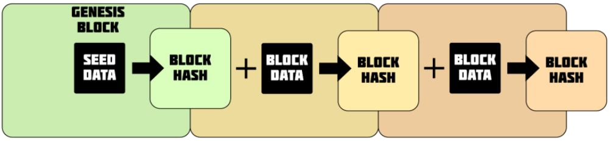

# Blockchain Example

### This is an example of a test driven blockchain with POW and Smart Contracts
| | | |
|-|-|-|
|Install code with | `npm i`| 
|Mining example| `npm run mine`|  blockchain-miner.js  
|Smart contract| `npm run smart`| blockchain-smart-contract.js 
|Secure date with secret| `npm run secure`|  blockchain-secure-data.js
|Runs tests| `npm test`| In test folder  

    

A blockchain is a continuously growing list of records, called blocks, which are linked and secured using cryptography. Each block contains a cryptographic hash of the previous block and transaction data.

One of the key mechanisms used to secure a blockchain is Proof of Work (POW). In POW, a miner solves a complex computational puzzle to create a new block and add it to the blockchain. Part of this puzzle involves finding a number, called a "nonce", that satisfies a specific requirement in order to create a valid hash for the new block. The nonce, along with the data from the previous block, is input into a cryptographic function to create a unique hash for the new block.

A nonce is an abritary number this is used to secured a block to a certain degree. Mining for a block in POW is really a race to find a nonce. In btc the level of difficulty to find this nonce is detremined by how many zeros a hash begins with. The previous block, transaction data, and the nonce are hashed together. Once a number is found that produces the desired number of zeros a block can be accepted. It is a quick opperation to share this nonce to others can use it to create the same hash. This is how a block is verified by other computers. It is a computationally hard task to find the nonce. This is why it is called proof of work.